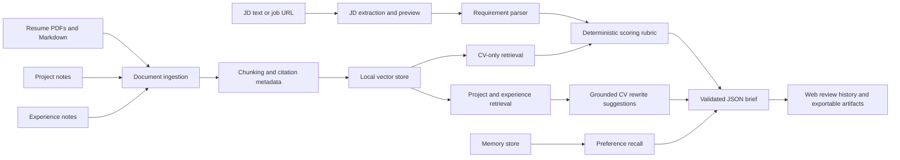

# AI Job Copilot

AI Job Copilot is a local, portfolio-ready agentic RAG system for comparing a
job description against your CV, then mining your projects and experience for
honest CV improvement recommendations.

It combines three AI engineering patterns:

- RAG over local CV, project, and experience evidence with citations.
- Durable memory for user preferences and career facts.
- Deterministic JSON contracts and retrieval evaluation.

The default path uses a local hashing embedder, so the demo runs without API
keys or model downloads. NVIDIA-hosted NIM chat and sentence-transformer
retrieval are optional when configured.

## Portfolio Story

This project is designed to show an end-to-end AI/data product, not just a
chatbot wrapper. The system first scores the current CV against the JD only,
then separately searches project and experience evidence to recommend honest
CV improvements. That separation is intentional: project notes can justify a
rewrite, but they should not inflate the score of a CV that does not currently
say the right things.

The strongest demo path is:

1. Put private evidence under `data/raw/resume/`, `data/raw/projects/`, and
   `data/raw/experience/`.
2. Start the web UI and paste a JD or preview a job URL.
3. Show the JD diagnostics: extracted role family, required skills, preferred
   skills, and responsibilities.
4. Run the review and explain the score, verdict, weak evidence, and skill
   gaps.
5. Use the CV Improvement Workspace to copy only grounded bullets, with source
   folder, file, chunk, confidence, and evidence excerpt visible.
6. Open the Evaluation page to show scoring benchmark pass rate, retrieval
   metrics, JD extraction health, and any failure cases.
7. Export or rerun after editing the CV to prove the score changes only when
   the resume evidence changes.

## Architecture



## Quickstart

```bash
python -m venv .venv
.venv\Scripts\activate
pip install -r requirements.txt

python -m career_copilot ingest --source data/raw --rebuild
python -m career_copilot remember --summary "I prefer backend AI engineering roles using Python, retrieval, and evaluation." --tags career,preference
python -m career_copilot recall "backend AI roles"
python -m career_copilot ask "Which projects show RAG, memory, and evaluation experience?" --no-llm
python -m career_copilot brief --job-file data/raw/jobs/job_posting.md --write-contract
python -m career_copilot export-cv-rewrite --brief outputs/latest_brief.json --output outputs/cv_rewrite.md
python -m career_copilot portfolio-report --source data/raw --output outputs/portfolio_report.md
python -m career_copilot serve
python -m career_copilot evaluate
python -m career_copilot evaluate-score
```

`--rebuild` resets the demo storage, including vector records and memory.

`brief` deliberately scores the JD against only indexed `resume/` or `cv/`
documents. Project and experience documents are used afterward as hidden
evidence for CV rewrites, not as proof that the current CV already matches.
Company research is shown as context, but it does not change the CV-vs-JD
score.
The output also includes an application verdict and grounded CV bullet
suggestions, so weak evidence can produce a blunt "do not apply yet" result.
The score is a role-aware rubric, not a hiring probability: it considers
required skill coverage, responsibility alignment, evidence depth, quantified
impact, and preferred skills. Simple keyword mentions are shown as matched
terms, but higher scores require credible CV evidence such as work, deployment,
production, or measured impact.

## Guided Workflow

For the local web UI:

```bash
python -m career_copilot serve --host 127.0.0.1 --port 8000
```

Open `http://127.0.0.1:8000`, choose a RAG folder, paste a JD or enter a job
URL, then run the review.

The web flow has two steps for URL-based jobs:

1. `Preview URL` extracts the JD and shows editable text plus detected
   requirements.
2. `Run Review` compares the edited JD against the indexed CV, then mines
   projects and experience for grounded improvements.

Use the History page to reopen previous review runs from `outputs/runs/`.
Use the Evaluation page to inspect reliability metrics and failure cases:

- Scoring benchmark pass rate over labeled strong, weak, hidden-evidence, and
  adversarial cases.
- Retrieval Recall@5, MRR, and nDCG@5 when a vector store has been indexed.
- JD extraction success rate and extraction method distribution from saved
  review runs.

The web UI is designed for local use. It only accepts RAG folders inside the
project directory and blocks job URLs that resolve to local/private network
addresses. Each review writes `outputs/latest_brief.json` plus a timestamped
copy under `outputs/runs/`.

URL extraction supports plain HTML, JSON-LD `JobPosting` pages, Eightfold,
Workday, Ashby, SmartRecruiters, Greenhouse, and Lever job links. LinkedIn
usually blocks automated extraction, so paste the JD text for LinkedIn roles.
Some job boards still render descriptions dynamically or block automated
fetches. If extraction cannot find a clean JD, paste the job description text
instead of using the URL.

The web form can also save a memory note and recall matching memories during a
review. The result page includes diagnostics showing extraction method, indexed
chunk count, LLM status, Exa status, and memory hits.

For day-to-day use, run the wizard:

```bash
python -m career_copilot wizard
```

The wizard asks for your RAG folder, whether to rebuild the index, an optional
memory note, the JD input mode, optional company research, and then writes:

```text
outputs/latest_brief.json
```

To show the project without private data, run the public sample demo:

```bash
python -m career_copilot demo
```

The demo uses only files under `examples/` and writes:

```text
outputs/demo_brief.json
```

## Optional NVIDIA LLM

`ask` gives local extractive answers when no LLM key is configured or when
`--no-llm` is passed. `brief` also uses NVIDIA, when configured, to add a blunt
human-readable review of whether your current CV is actually competitive. To
enable NVIDIA-hosted NIM chat:

```powershell
$env:NVIDIA_API_KEY="your_key_here"
$env:NVIDIA_MODEL="google/gemma-4-31b-it"
python -m career_copilot ask "How should I pitch my RAG experience?"
```

Optional environment variables:

- `NVIDIA_API_KEY`: required for hosted NVIDIA NIM chat.
- `NVIDIA_MODEL`: defaults to `google/gemma-4-31b-it`.
- `NVIDIA_BASE_URL`: defaults to `https://integrate.api.nvidia.com/v1`.
- `NVIDIA_MAX_TOKENS`: defaults to `2048`.
- `NVIDIA_TEMPERATURE`: defaults to `1.0`.
- `NVIDIA_TOP_P`: defaults to `0.95`.
- `NVIDIA_TIMEOUT`: defaults to `120` seconds.

## Optional Company Web Research

For company/job context from the web, set `EXA_API_KEY` and use Exa-backed
research. Fetched job pages and research notes are cached by default under
`data/raw/jobs/` and `data/raw/company_research/` so the sources remain
auditable.

```powershell
$env:EXA_API_KEY="your_exa_key_here"
python -m career_copilot brief --job-url "https://company.com/careers/job-123" --research-company
python -m career_copilot brief --job-text "Paste JD here" --company "NVIDIA" --research-company
python -m career_copilot research-company --company "NVIDIA" --role "AI Engineer"
```

Use `--no-cache` if you want fetched job text or company research to be used
only for the current command.

## Use Your Own Experience Folder

Put your CV, resume, project notes, certificates, and experience writeups in one
folder. Markdown, text, and PDF files are supported:

```text
my-experience/
  resume/
    cv.pdf
    resume.md
  projects/
    rag-system.md
    agent-memory.md
  experience/
    internships.md
    work-history.pdf
```

Then index that folder as the RAG source:

```bash
python -m career_copilot ingest --source path\to\my-experience --rebuild
python -m career_copilot ask "Which experience proves I can build RAG systems?" --no-llm
python -m career_copilot brief --job-file path\to\job_posting.md
python -m career_copilot brief --job-text "Paste the job description here"
python -m career_copilot brief --job-url "https://company.com/careers/job-123"
```

Use memory for facts that should persist across sessions but are not source
documents, such as role preferences, interview goals, or facts you do not want
to repeat:

```bash
python -m career_copilot remember --summary "I prefer AI engineer roles with backend Python, RAG, and evaluation." --tags preference
python -m career_copilot recall "preferred AI role"
python -m career_copilot ask "How should I pitch myself for this role?" --no-llm
```

`ask` automatically combines retrieved RAG evidence with relevant memories.
`recall` searches only the durable memory store.

The category folders are used in citations and JSON output:

- `resume/` or `cv/`: CV, resume, profile, skills summaries.
- `projects/` or `project/`: portfolio projects, case studies, GitHub notes.
- `experience/` or `work/`: internships, work history, certificates, impact notes.
- `jobs/`: optional sample job descriptions for demos.

Your private files should stay under `data/raw/`, which is ignored for private
resume/project/experience documents. Safe public examples live under
`examples/`.

## What It Demonstrates

- Document ingestion, cleaning, chunking, and citation tracking.
- PDF page ranges in citations when resumes or experience files are PDFs.
- Retrieval scoring with semantic hashing plus lexical reranking.
- Persistent memory with deterministic BM25 retrieval.
- Web memory controls for saving and recalling career preferences.
- Web review history for opening previous saved runs.
- JD URL preview with editable extracted text and requirement diagnostics.
- CV Improvement Workspace with keep/rewrite/add/missing-evidence lanes.
- Evaluation dashboard for scoring, retrieval, JD extraction, agent reliability,
  and failure-case visibility.
- Grounded claim verifier for generated CV bullets, including safe-to-claim
  status and required evidence warnings.
- Explainable score breakdown with points, credited evidence, missing evidence,
  and component-level reasons.
- Adversarial benchmark cases for shallow keyword resumes, hidden project
  evidence, weak senior-role evidence, wrong-domain matching, and alias gaps.
- Separate JD-to-CV scoring from project/experience-based CV recommendations.
- Role-aware job-fit scoring for data scientist, AI engineer, and ML engineer
  roles.
- Application verdicts with apply/no-apply guidance.
- Grounded CV rewrite bullets that cite project or experience chunks.
- Multi-agent Hermes review when NVIDIA chat is configured, with schema-checked
  structured agent traces, contradiction detection, latency diagnostics, and
  deterministic fallback.
- Structured job-fit output with a validated JSON result contract.
- Review diagnostics for extraction method, LLM/web status, indexed chunks, and
  memory influence.
- Objective retrieval metrics: Recall@k, MRR, and nDCG@k.
- Scoring-quality evaluation cases for checking score bands and verdicts.
- Portfolio-grade `evaluate-all` report combining scoring, retrieval, agent
  quality, structured-output rate, schema errors, latency, and contradiction
  findings.
- Markdown CV rewrite exports and portfolio coverage reports.

## CLI

```bash
python -m career_copilot ingest --source data/raw --rebuild
python -m career_copilot ask "How should I pitch my AI engineering projects?" --no-llm
python -m career_copilot remember --summary "Target roles should emphasize evaluation and reliable AI systems."
python -m career_copilot recall "target roles"
python -m career_copilot brief --job-file data/raw/jobs/job_posting.md
python -m career_copilot brief --job-text "Paste the JD here"
python -m career_copilot brief --job-url "https://company.com/careers/job-123" --research-company
python -m career_copilot brief --job-text "Paste the JD here" --output outputs/latest_brief.json
python -m career_copilot export-cv-rewrite --brief outputs/latest_brief.json --output outputs/cv_rewrite.md
python -m career_copilot portfolio-report --source data/raw --output outputs/portfolio_report.md
python -m career_copilot serve
python -m career_copilot wizard
python -m career_copilot demo
python -m career_copilot evaluate --k 5
python -m career_copilot evaluate-score --cases benchmarks/scoring_cases.jsonl
python -m career_copilot evaluate-all
```

`evaluate-score` uses labeled cases with expected score bands and verdicts.
`evaluate-all` combines scoring benchmarks, retrieval metrics, latest agent
trace quality, contradiction findings, and JD extraction health into one JSON
report.
`export-cv-rewrite` turns grounded rewrite suggestions into a Markdown plan
with source chunks, target terms, confidence, and a safe-to-claim flag.
`portfolio-report` summarizes project/experience coverage for data scientist,
AI engineer, and ML engineer role families, then recommends what to document or
build next.

## Result Contract

When `AI_JOB_COPILOT_RESULT_PATH` is set, `brief --write-contract` writes a JSON
object with:

- `job_title`
- `schema_version`
- `fit_score`
- `role_family`
- `jd_requirements`
- `evidence_depth`
- `scoring_breakdown`
- `score_explanations`
- `weak_evidence`
- `cv_jd_review`
- `cv_match`
- `matched_evidence`
- `hidden_evidence`
- `skill_gaps`
- `application_verdict`
- `cv_rewrite_suggestions`
- `recommended_actions`
- `brutal_assessment`
- `llm_brutal_review`
- `llm_agent_steps`
- `agent_trace`
- `agent_consensus`
- `agent_contradictions`
- `citations`
- `confidence`
- `diagnostics`

This mirrors production agent workflows where conversational text is not the
source of truth; a validated artifact is.
